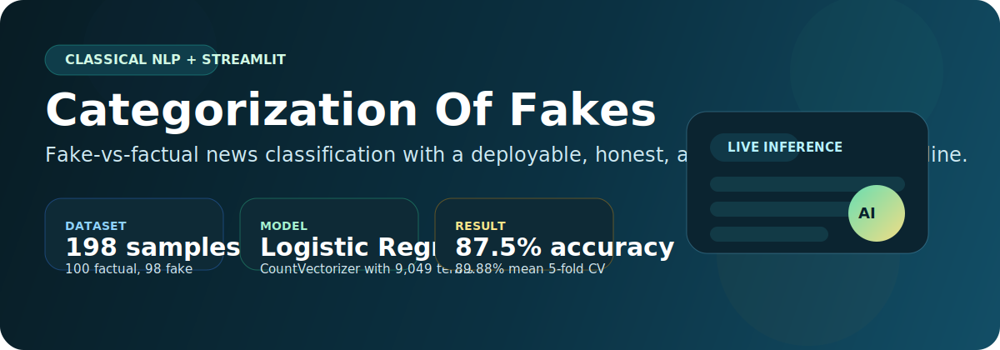
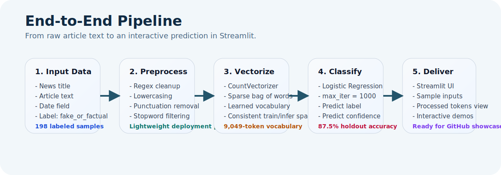
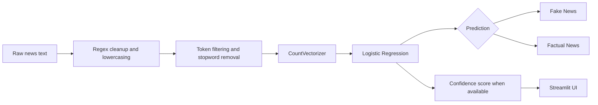
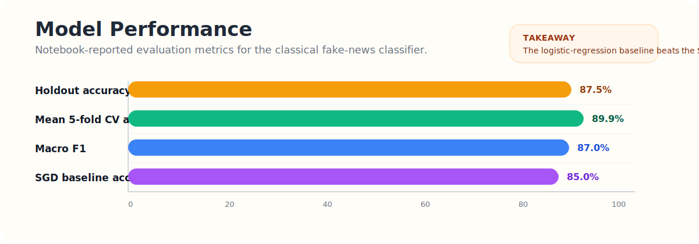
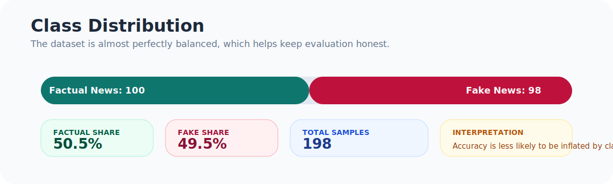

# Categorization Of Fakes

<p align="center">
  
</p>

<p align="center">
  A practical NLP project for classifying news text as <strong>Fake News</strong> or <strong>Factual News</strong> using a bag-of-words pipeline, logistic regression, and a Streamlit inference app.
</p>

<p align="center">
  <a href="https://fake-and-factual-news-categorization-khawajaibrahimsalim1.streamlit.app/">Live Demo</a>
  |
  <a href="./Categorization%20Fake%20News.ipynb">Training Notebook</a>
  |
  <a href="./streamlit_app.py">Streamlit App</a>
</p>

<p align="center">
  
  
  
  
</p>

## Overview

This repository frames fake-news detection as a supervised text-classification problem. Given a news snippet or article body, the model predicts whether the language resembles the patterns of **fake news** or **factual news** observed during training.

The project combines two complementary surfaces:

- A research notebook for data exploration, preprocessing, classical NLP analysis, and model evaluation
- A Streamlit application for interactive inference with pre-trained artifacts

This is intentionally a **classical ML baseline** rather than a large language model system. For a small labeled dataset, linear models over sparse lexical features are fast, interpretable, and often stronger than people expect.

## Why This Project Matters

Misinformation detection is not only a modeling problem, it is a framing problem. This project does **not** claim to verify objective truth on the open web. Instead, it learns whether a piece of text looks more like the fake or factual reporting style represented in the training corpus.

That distinction matters:

- It makes the system honest about what it can and cannot do
- It keeps evaluation grounded in measurable supervised learning outcomes
- It provides a strong educational baseline before moving to transformers, retrieval, or source-grounded fact checking

## At a Glance

| Component | Details |
| --- | --- |
| Task | Binary text classification: `Fake News` vs `Factual News` |
| Dataset | `198` labeled news samples |
| Class balance | `100` factual, `98` fake |
| Features | `CountVectorizer` bag-of-words representation |
| Vocabulary size | `9,049` tokens in the saved vectorizer |
| Model | `LogisticRegression(max_iter=1000)` |
| App | Streamlit interface with sample inputs and confidence display |
| Best reported result | `87.5%` holdout accuracy |
| Robustness signal | `89.88%` mean 5-fold cross-validation accuracy |

## System Design

<p align="center">
  
</p>



## Results

<p align="center">
  
</p>

The notebook reports the following headline metrics for the final logistic-regression model:

| Metric | Value |
| --- | --- |
| Holdout accuracy | `87.5%` |
| Macro F1 | `0.87` |
| Fake News recall | `0.90` |
| Factual News precision | `0.89` |
| Mean 5-fold CV accuracy | `89.88%` |
| SGD baseline accuracy | `85.0%` |

### Holdout Confusion Matrix

| Actual / Predicted | Factual News | Fake News |
| --- | ---: | ---: |
| Factual News | `16` | `3` |
| Fake News | `2` | `19` |

These numbers are promising for a compact classical pipeline, but the dataset is still small enough that the results should be treated as **directional rather than production-grade**.

## Data Snapshot

<p align="center">
  
</p>

The training data in [`fake_news_data.csv`](./fake_news_data.csv) contains the following columns:

- `title`
- `text`
- `date`
- `fake_or_factual`

This near-balanced label distribution is useful because it reduces the chance that headline accuracy is inflated by a dominant class.

## Repository Layout

```text
Categorization Of Fakes/
|-- Categorization Fake News.ipynb
|-- streamlit_app.py
|-- fake_news_data.csv
|-- model.pkl
|-- countvec.pkl
|-- requirements.txt
`-- assets/
    `-- readme/
        |-- hero.svg
        |-- pipeline.svg
        |-- performance.svg
        `-- class-distribution.svg
```

## Local Setup

### Run The Streamlit App

```bash
cd "NLP_Course_ENV/Categorization Of Fakes"
python -m venv .venv
.venv\Scripts\activate
pip install -r requirements.txt
streamlit run streamlit_app.py
```

The app loads `model.pkl` and `countvec.pkl` directly, so you can run inference immediately without retraining the model.

### Revisit The Training Notebook

Open [`Categorization Fake News.ipynb`](./Categorization%20Fake%20News.ipynb) to inspect:

- Exploratory analysis over fake and factual articles
- Preprocessing decisions and feature engineering
- Classical NLP exploration such as POS, NER, sentiment, and topic analysis
- Model training, evaluation, and baseline comparison

Note: the current `requirements.txt` is enough for the deployed Streamlit app. The notebook imports additional research-time NLP libraries that may need to be installed separately if you want to rerun every exploratory cell end to end.

## Methodology

The final deployed system follows a simple and defensible pipeline:

1. Clean raw text with regex-based normalization.
2. Lowercase and strip punctuation.
3. Remove common stopwords.
4. Convert text into sparse bag-of-words features using `CountVectorizer`.
5. Train a logistic-regression classifier on the vectorized representation.
6. Serve predictions through a Streamlit UI with optional confidence output.

One practical engineering detail worth calling out: the app uses a built-in English stopword set instead of runtime NLTK downloads, which keeps deployment lighter and avoids fragile environment setup.

## Example Product Behavior

The Streamlit app is designed for quick interactive testing:

- Paste a news paragraph into the text area
- Use the built-in fake and factual sample buttons for fast demos
- Inspect the processed tokens used by the classifier
- Review the predicted label and confidence score

This makes the repository useful both as a learning artifact and as a lightweight demo application.

## Limitations

Every fake-news project benefits from strong caveats, and this one is no exception:

- The dataset is small, so performance estimates can move noticeably with different splits
- The model detects linguistic patterns, not verified ground truth from external evidence
- Generalization to new publishers, new political cycles, or non-news text is limited
- Bag-of-words features ignore deeper semantics, discourse structure, and source credibility
- Confidence scores reflect model certainty, not factual certainty

## Responsible Use

This project should be treated as an **educational classification baseline**. It is appropriate for:

- Demonstrating an end-to-end NLP workflow
- Exploring interpretable text-classification methods
- Building a simple fake-vs-factual demo app

It should not be used as a standalone moderation or fact-checking authority without stronger data, broader validation, source attribution, and human review.

## Next Steps

Natural extensions for this project include:

- Expanding the dataset and evaluating on a temporally separated test split
- Comparing `CountVectorizer` with `TF-IDF`, character n-grams, and calibrated linear models
- Adding explainability views for top contributing terms
- Introducing transformer baselines for comparison
- Incorporating source metadata or retrieval-backed fact checking

## Demo

The public Streamlit deployment is available here:

**[Launch the live app](https://fake-and-factual-news-categorization-khawajaibrahimsalim1.streamlit.app/)**

---

If you are exploring classical NLP projects, this repository is a solid example of how to move from exploratory text analysis to a lightweight deployed classifier with clear evaluation and honest scope boundaries.
